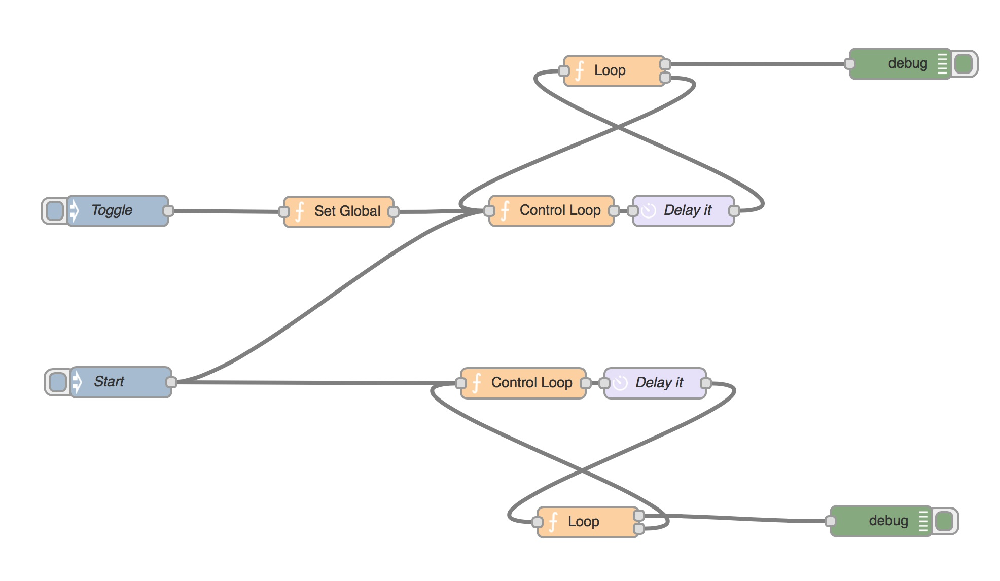

node-red-node-splitter
====================

This node iterates over an array.
Original work by Leon van Kammen, http://coderofsalvation.github.io / http://github.com/coderofsalvation

"big" tweak by me

# The original work and idea

https://www.npmjs.com/package/node-red-contrib-splitter

# The fork

In order to get the information over the start and the end, I've made some tweaks


# Here is the original help and documentation from Leon van Kammen


In the end 'splitter' is the best name imho.
More info [here](http://www.enterpriseintegrationpatterns.com/Sequencer.html)

# Why a node?

Well..look at this image, and then imagine using 10 loops in a similar way:



Got the point?
With visual progarmming the [Deutsch Limit](http://en.wikipedia.org/wiki/Deutsch_limit) seems to lure around every corner. Better to make a node for that.

# Installation

Run: 

    npm install node-red-contrib-bigsplitter

# Example

```json
[{"id":"7c6e62ea.e2db7c","type":"bigsplitter","z":"38362b82.762cc4","name":"","property":"payload","x":384,"y":199,"wires":[[],[]]},{"id":"6722667a.9a7108","type":"bigsplitter","z":"38362b82.762cc4","name":"","property":"payload","x":381,"y":91,"wires":[["50e27884.e42888"],["d1bca856.6625f8"]]},{"id":"6b5eb21f.a9e65c","type":"inject","z":"38362b82.762cc4","name":"Go!","topic":"","payload":"","payloadType":"date","repeat":"","crontab":"","once":false,"x":112,"y":91,"wires":[["b0eee2c1.98e38"]]},{"id":"b0eee2c1.98e38","type":"function","z":"38362b82.762cc4","name":"data","func":"msg.payload = [ 1, 2, 3, 4, 5, 6 ]\nreturn msg;","outputs":1,"noerr":0,"x":240.5,"y":91,"wires":[["6722667a.9a7108"]]},{"id":"50e27884.e42888","type":"debug","z":"38362b82.762cc4","name":"data","active":true,"console":"false","complete":"payload","x":530.5,"y":69,"wires":[]},{"id":"d1bca856.6625f8","type":"debug","z":"38362b82.762cc4","name":"control","active":true,"console":"false","complete":"true","x":531,"y":123,"wires":[]},{"id":"cf5b3201.9fb9c","type":"comment","z":"38362b82.762cc4","name":"Sample bigsplitter usage","info":"","x":147.5,"y":45,"wires":[]},{"id":"a53aa76d.26d7a8","type":"inject","z":"38362b82.762cc4","name":"Go!","topic":"","payload":"","payloadType":"date","repeat":"","crontab":"","once":false,"x":111,"y":199,"wires":[["4a3bd19d.d3261"]]},{"id":"4a3bd19d.d3261","type":"function","z":"38362b82.762cc4","name":"data","func":"var ret = []\nfor (i = 0; i < 2000; i++) {\n    ret.push(i);\n}\nreturn {payload: ret}","outputs":1,"noerr":0,"x":247,"y":199,"wires":[["7c6e62ea.e2db7c"]]}]
```


# Author

Leon van Kammen, http://coderofsalvation.github.io / http://github.com/coderofsalvation
Jacques W, https://github.com/Jacques44

# License 

BSD
